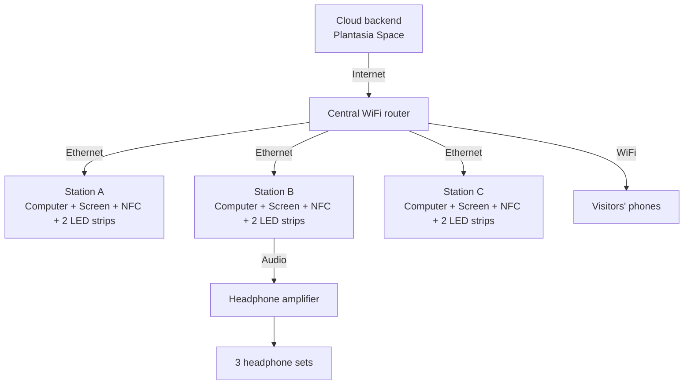

import DiagramFrame from '../../../../components/media/DiagramFrame.astro';
import Mark from '../../../../components/patterns/Mark.astro';
import { HELIX as M } from '../../../../config/articles';

# Helix — Technical <Mark tilt={2} tear={2}>Requirements</Mark>

HELIX Technical installation documentation Espacio de Arte Contemporáneo (EAC) Montevideo, Uruguay 2025 Helix is a real-time interactive artwork that requires an active internet connection throughout…

## Helix

### Technical installation documentation

**Espacio de Arte Contemporáneo (EAC)**  
Montevideo, Uruguay  
2025

Helix is a real-time interactive artwork that requires an active internet connection throughout the entire exhibition period.

The work runs through a web interface: the installation computers and visitors' phones connect in real time to a cloud backend that manages sound content, interactions, and the overall experience. This backend is part of Plantasia Space, the platform on which the work is built.

A fully local version is not viable within the framework of this installation, since network connectivity is a constitutive part of how the work operates.

## 1. General description

Helix is an interactive installation organized around three computer stations arranged in a triangular formation. Each station consists of a computer, a large screen, an NFC reader, and two LED strips.

The three computers connect via ethernet cable to a central WiFi router, which also broadcasts a wireless network for visitors' mobile phones. A shared headphone amplifier distributes audio to three sets of headphones.

## 2. Internet connectivity requirements

- Minimum recommended speed: 10 Mbps symmetric, dedicated to the installation
- Stable connection throughout exhibition opening hours
- WiFi network for visitors' phones, included in the technical design
- No firewall restrictions blocking standard web traffic (HTTPS)

The connection is especially critical at the beginning of each day, when the main content of the artwork is loaded.

## 3. Network topology

The three computers form a triangle, each connected to the central WiFi router through a dedicated ethernet cable. The router also provides a WiFi network for visitors' mobile phones.

## 4. Interactive diagram

<DiagramFrame src={M.diagram} title="Helix interactive diagram" height="980" />

## 5. Physical layout

The three stations are arranged in an equilateral triangle. The WiFi router and headphone amplifier are placed in the center or on a designated technical table. The LED strips run through the structure or across the floor between stations.

- Station A: upper vertex of the triangle
- Station B: lower left base
- Station C: lower right base
- Router: central position, equidistant from all three stations
- Headphone amplifier: next to Station B, the audio source computer

## 6. Base equipment inventory

### Computing and network

- 3 computers
- 1 central WiFi router
- 3 dedicated ethernet cables

### Displays and interaction

- 3 large screens
- 3 NFC readers
- 6 LED strips

### Audio

- 1 headphone amplifier
- 3 sets of headphones

## 7. Notes and checklist

- Confirm cable lengths are sufficient for the triangular layout before final installation
- Label all cables, A, B, and C, on both ends to avoid confusion during setup
- Configure the router SSID and password and share them with venue staff
- Verify that all computers are set to launch the software automatically on startup
- Adjust amplifier levels to an appropriate listening volume before opening to the public
- Document the IP addresses of each computer for possible remote troubleshooting
