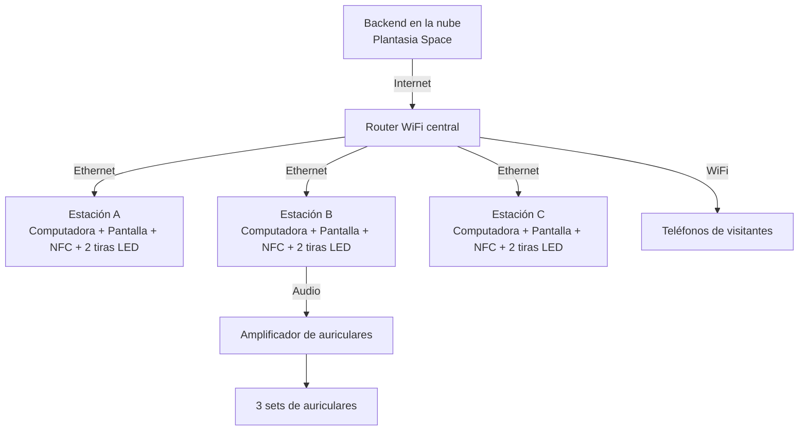

import DiagramFrame from '../../../../components/media/DiagramFrame.astro';
import Mark from '../../../../components/patterns/Mark.astro';
import { HELIX as M } from '../../../../config/articles';

{/*
  La traducción de src/content/pages/en/lab/helix-technical-requirements.mdx.

  El único trozo de markup que traía era el marco del diagrama, y el diagrama es
  una página de este mismo sitio: no hay tercero a quien pedirle permiso, así
  que va en un marco directo y no en una fachada. La dirección vive en
  config/articles.ts porque un diagrama no se traduce; el título sí. MW-19.
*/}

# Helix — <Mark variant="highlight">Requisitos</Mark> técnicos

HELIX Documentación técnica de instalación Espacio de Arte Contemporáneo (EAC) Montevideo, Uruguay 2025 Helix es una obra de arte interactiva en tiempo real que requiere conexión a internet activa du…

## HELIX

### Documentación técnica de instalación

**Espacio de Arte Contemporáneo (EAC)**  
Montevideo, Uruguay  
2025

Helix es una obra de arte interactiva en tiempo real que requiere conexión a internet activa durante toda la exhibición.

La obra funciona a través de una interfaz web: las computadoras de la instalación y los teléfonos de los visitantes se conectan en tiempo real a un backend en la nube que gestiona el contenido sonoro, las interacciones y la experiencia. Este backend es parte de Plantasia Space, la plataforma sobre la que está construida la obra.

Una versión completamente local no es viable en el marco de esta instalación, ya que la conexión en red es parte constitutiva del funcionamiento de la obra.

## 1. Descripción general

Helix es una instalación interactiva organizada en torno a tres estaciones de cómputo dispuestas en formación triangular. Cada estación consiste en una computadora, una pantalla grande, un lector NFC y dos tiras de LED.

Las tres computadoras se conectan por cable ethernet a un router WiFi central, que además emite una red inalámbrica para los teléfonos de las personas visitantes. Un amplificador de auriculares compartido distribuye el audio a tres sets de auriculares.

## 2. Requisitos de conexión a internet

- Velocidad mínima recomendada: 10 Mbps simétricos dedicados a la instalación
- Conexión estable durante todo el horario de exhibición
- Red WiFi para los teléfonos de los visitantes, contemplada en el diseño técnico
- Sin restricciones de firewall que bloqueen tráfico web estándar (HTTPS)

La conexión es especialmente crítica al inicio de cada jornada, cuando se cargan los contenidos principales de la obra.

## 3. Topología de red

Las tres computadoras forman un triángulo, cada una conectada al router WiFi central mediante un cable ethernet dedicado. El router también emite una red WiFi para los teléfonos móviles de las personas visitantes.

## 4. Diagrama interactivo

<DiagramFrame src={M.diagram} title="Diagrama interactivo de Helix" height="980" />

## 5. Disposición física

Las tres estaciones se disponen en triángulo equilátero. El router WiFi y el amplificador de auriculares se ubican en posición central o en una mesa técnica designada. Las tiras LED recorren la estructura o el suelo entre estaciones.

- Estación A: vértice superior del triángulo
- Estación B: base izquierda
- Estación C: base derecha
- Router: posición central, equidistante de las tres estaciones
- Amplificador de auriculares: junto a Estación B, computadora fuente de audio

## 6. Inventario base de equipamiento

### Cómputo y red

- 3 computadoras
- 1 router WiFi central
- 3 cables ethernet dedicados

### Pantallas e interacción

- 3 pantallas grandes
- 3 lectores NFC
- 6 tiras LED

### Audio

- 1 amplificador de auriculares
- 3 sets de auriculares

## 7. Notas y lista de verificación

- Confirmar que la longitud de los cables es suficiente para el layout triangular antes de la instalación definitiva
- Etiquetar todos los cables, A, B y C, en ambos extremos para evitar confusiones durante el montaje
- Configurar el SSID y contraseña del router y compartirlos con el personal de sala
- Verificar que todas las computadoras estén configuradas para lanzar el software automáticamente al arrancar
- Ajustar los niveles del amplificador a un volumen adecuado para el público antes de la apertura
- Documentar las direcciones IP de cada computadora para posible resolución remota de problemas
